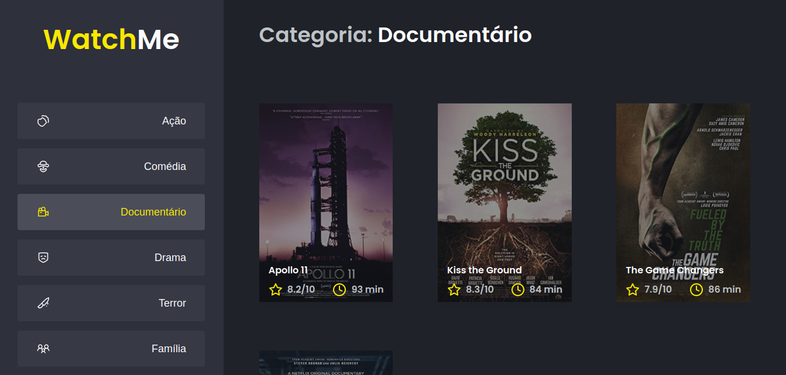

# 🚀 Ignite - Desafio 02 - Componentizando a aplicação

Nesse desafio, você deverá criar uma aplicação para treinar o que aprendeu até agora no ReactJS

Essa será uma aplicação onde o seu principal objetivo é refatorar uma página para listagem de filmes de acordo com gênero.

A aplicação já está totalmente funcional mas grande parte do seu código está diretamente no arquivo `App.tsx`. Para resolver isso da melhor forma, é necessário dividir a aplicação em **pelo menos** duas partes principais: sidebar e o conteúdo principal que possui o header e a listagem de filmes.

- A aplicação possui apenas uma funcionalidade principal que é a listagem de filmes;
- Na sidebar é possível selecionar qual categoria de filmes deve ser listada;
- A primeira categoria da lista (que é "Ação") já deve começar como marcada;
- O header da aplicação possui apenas o nome da categoria selecionada que deve mudar dinamicamente.

## Excecutar local de desenvolvimento 🏠

Clone o projeto

```bash
  git clone https://github.com/pcbrsites/ignite-componentizando-a-aplicacao
```

Vá para diretório do projeto

```bash
  cd ignite-componentizando-a-aplicacao
```

Instale as dependências

```bash
  npm install
  # ou
  yarn install
```

Iniciar o servidor

```bash
  npm run dev
  # ou
  yarn run dev
```

### Rodar Servidor JSON

```bash
  npm run server
  # ou
  yarn run server
```

## License

[MIT](https://choosealicense.com/licenses/mit/)
